# svg-animator

<p align="center">
  
</p>

<p align="center">
  <em>A skill that teaches an AI agent to make animated SVGs that are <b>correct</b>,<br>
  not just plausible — anywhere an SVG renders: READMEs, docs, sites, slides, email.</em>
</p>

---

## Why this exists

Ask a model to "make an animated architecture diagram for my README" and you get
something that *looks* right in the source. Then you open it and:

- the travelling dot cuts **straight through** a card instead of along the rail
- three glows fire at once because somebody eyeballed `keyTimes="0.46"`
- the loop has a visible **seam** — everything blinks at the restart
- frame 0 is an **empty box**, so anyone on a phone, in a PDF, or in a client that
  doesn't run SMIL sees nothing at all
- arrows stop 20px short of the thing they point at

None of these are hard. They're all just *unverified*. SVG animation fails
**silently** — a wrong `keyTime` still runs, it just runs wrong, and a model has
no way to notice by reading the XML.

So this skill doesn't ask the model to be careful. It gives it a **lint, a frame
renderer, and a rule that looking is mandatory.**

```
BRIEF → ROUTE → SPEC → BUILD → LINT → FRAMES → FIX LOOP → DELIVER
```

One command runs build → lint → frames and ends with `RESULT: PASS / PASS WITH WARNINGS / FAIL`.
It never lies about what it checked.

---

## Install

The skill is a folder of Markdown, Python and JSON. Copy it where your agent looks
for skills — the layout is deliberately conventional.

```bash
git clone https://github.com/takimdigital/svg-animator.git

# Claude Code / most agent harnesses
cp -r svg-animator ~/.claude/skills/

# or symlink it so updates land everywhere
ln -s "$PWD/svg-animator" ~/.claude/skills/svg-animator
```

Optionally install the one runtime dependency (frame rendering only — lint and
generate work without it):

```bash
pip install playwright && python -m playwright install chromium
```

**Requirements:** Python 3.9+. That's it. No Node, no build step, no npm.

---

## Use it in one command

Ask your agent for an animated SVG. It'll route itself. If you want to drive the
generator directly:

```bash
# 1. pick a spec from assets/specs/ and edit the labels to be yours
$EDITOR assets/specs/flow-with-feedback.json

# 2. build + lint + render frames, all at once
python scripts/run_pipeline.py assets/specs/flow-with-feedback.json \
        --out-dir run --name my-diagram

# 3. LOOK at run/frames/*.png before you ship anything
```

```
RESULT: PASS (0 errors, 0 warnings) - now view the frames
```

A `PASS` is not a compliment, it's a floor. It means the file is structurally
sound. Whether it looks *good* is a separate question, answered by looking.

---

## Three ways in

<p align="center">
  
</p>

### A · Generator — 22 types, one JSON spec

The fast, reliable path. You write data; it computes the geometry and the timing.

| Diagrams | Things |
|---|---|
| `flow` · `radial` · `phases` · `timeline` | `loader` · `logo` · `text` · `gauge` · `radar` |
| `network` · `layers` · `cycle` · `sequence` | `backdrop` · `icons` · `scene` · `counter` · `art` |
| `terminal` · `cards` · `chart` · `banner` | `compose` (any of the above, one canvas) |

```json
{"type": "flow", "dur": 10, "arrows": true,
 "columns": [
   [{"id": "u", "label": "User", "sub": "intent"}],
   [{"id": "c", "label": "CORE", "sub": "pool", "key": true}],
   [{"id": "x", "label": "Client"}, {"id": "y", "label": "Server"}]],
 "edges": "auto",
 "feedback": {"id": "m", "label": "Maintainer", "from": "x", "to": "c"}}
```

Every keyTime, rail endpoint and arrowhead offset is **derived** — that's the
whole point. Themes: `ember ocean forest mono paper violet sunset`, or override
any palette token.

<p align="center">
  
</p>

### B · Hand-build — anything the generator can't

A mascot. A bespoke logo. A scene with an opinion. Decompose it: **nouns → shapes,
verbs → motion**, then draw the still first and animate second.

<p align="center">
  
</p>

The mark above is Mode B — hand-written, geometry computed rather than eyeballed.
Note the S-curve's control points share their `y` with their endpoints, so the
traveller arrives moving horizontally and the arrowhead sits flat; and note the dot
fades out at 90% before teleporting back, so the loop restart is invisible.

### C · Fix — an SVG that already exists

Paste in something broken. The skill cleans paste artifacts (`\<svg`,
`xlink\:href`, smart quotes), inventories every animation before touching it,
maps symptom → cause → fix, and changes as little as possible.

---

## The gallery

Twelve of the 53 generator outputs, at uniform tile size. Every one is lint-clean
(`0 errors, 0 warnings`) — click any for the full-size version and the spec behind it.

<a href="docs/gallery/README.md">
  
  
  
  
</a>

<a href="docs/gallery/README.md">
  
  
  
  
</a>

<a href="docs/gallery/README.md">
  
  
  
  
</a>

<p align="center">
  <sub>All twelve are real generator output. <a href="docs/gallery/README.md">See the full gallery →</a></sub>
</p>

## Morphing shapes plain SMIL refuses to interpolate


`<animate attributeName="d">` interpolates **only** when both paths have the same
command structure — same commands, same order, same count. SVG 2 says so, and
otherwise it falls back to *discrete*, which means the shape **snaps**. A square
does not tween into a triangle; it jumps. The markup is well-formed, so a linter
sees nothing wrong, and the file lints clean while quietly not moving.

GSAP's MorphSVGPlugin solves it, and it is excellent — but it needs GSAP *and*
JavaScript, and an SVG carrying `<script>` stops animating inside a README
``.

So this skill fixes it at author time instead. `scripts/morph_path.py` flattens
both shapes to polylines, resamples them to the same number of points by arc
length, and re-emits both as one uniform `M + n·C + Z` signature — the only form
SMIL interpolates. No library, no JavaScript, works in ``:

```python
from morph_path import morph_pair, signature

a, b = morph_pair(star_d, circle_d, n=24)   # 5 commands vs an arc: no shared structure
assert signature(a) == signature(b)         # M + 24 C's — now SMIL will interpolate
```

Two details that decide whether it looks deliberate or looks broken:

**Align the correspondence.** Resampling pairs points by equal arc-length
fraction, which fixes the correspondence wherever each path happens to start.
A circle and a heart that both begin near the top still pair the circle's right
side with the heart's left notch, and the shape collapses to a sliver crossing
over. Trying every cyclic shift and keeping the cheapest cut total travel by
**67%** across the six pairs above, and **99%** on circle → heart specifically.
It is on by default; `align=False` turns it off.

**Refuse shapes with holes.** A ring or a donut has two subpaths; flattening
them into one polyline produces something wrong at *every* frame rather than
obviously broken, so `morph_pair` raises instead of shipping garbage. The same
reasoning is why `verify.py` ships with two checks cut — see its docstring.

Honest limits: mid-morph aesthetics are approximate (`heart → bolt` above still
pinches through a thin sliver), and cost grows linearly with `n` — the example
is 39 KB, the gallery tile 80 KB. Full write-up, including the spec fields and
the twelve named forms, in `references/morphing.md`.

## The seven principles

Every graphic this skill produces obeys these. They're the difference between
"animation" and "a moving thing that's wrong."

**1 · Static-first.** Frame 0 is already a complete, good-looking graphic. Base
shapes are always visible; motion is an *overlay* that starts at `opacity="0"`.
If the animation never runs — mobile preview, PDF export, a client without SMIL —
the viewer still sees the whole picture. This is why the terminal type isn't typed
into existence: all the text is in the DOM, and cover rectangles slide away.

**2 · Compute, don't guess.** Layout, rail endpoints and every `keyTime` come out
of a spec or the linter. Nobody types `0.46` because it feels right.

**3 · Motion follows drawn lines.** Dots travel on rails that exist, each rail
touches its cards, and nothing crosses a card or its text unless crossing is the
entire point.

**4 · One master clock.** One loop length; every phase is a fraction of it;
secondary pulses are `dur/2` or `dur/4`. Leave ~10% of the loop at rest so the
seam is invisible.

**5 · Self-contained.** System font stacks, everything inlined, no scripts, no
external assets. One `.svg` file that works offline, forever.

**6 · Verify by looking.** Lint, render frames at meaningful timestamps, *view
them*, and say what you actually saw.

**7 · Report honestly.** State what was verified and what wasn't. Comments in the
SVG restate lint and frame results — never intentions.

---

## What the linter catches

`scripts/lint_svg_anim.py` — 31 KB of the "don't ship this broken" department:

- `keyTimes`/`values`/`keySplines` count mismatches, non-monotonic or unterminated keyTimes
- glow and opacity windows that never return to `0` — the classic half-faded ghost
- **whether each dot's path is geometrically identical to the rail it rides**
- **whether a rail actually touches the cards it claims to connect**
- **when each dot enters and leaves each card**, and whether it crosses one it shouldn't
- unresolvable `url(#id)` / `href="#id"` references
- duplicate IDs
- invisible elements that are supposed to be hidden, and visible ones that aren't
- files over 100 KB or with a runaway SMIL node count
- CSS transforms missing `transform-box: fill-box` (they silently rotate around
  the wrong origin)
- arrowheads that don't land on their target's edge
- **a `<text>` label wider than the shape it sits in** — reported width against
  the shape's usable width (for a circle, the chord at the label's baseline, not
  the diameter)

It takes many paths at once, checks **all** of them, and exits non-zero if any file
has an error — so `lint_svg_anim.py $(git diff --name-only '*.svg')` really does
verify every file you changed.

And it tells you the *diagnostic*, not just the verdict — it prints each dot's
enter/leave times per card so you can fix the cause instead of nudging a number.

---

## Layout

```
svg-animator/
├── SKILL.md                     the pipeline, the rules, the routing
├── CONTRIBUTING.md              how to submit a PR (human or agent)
├── references/                  read on demand, not upfront
│   ├── diagram-types.md           12 diagram types + compose: every spec field
│   ├── animated-things.md         10 non-diagram types
│   ├── combinations.md            effect recipes, compose recipes, choreography
│   ├── readme-diagrams.md         the 12 techniques behind README-grade diagrams
│   ├── diagrams.md                diagram rules + failure modes
│   ├── motion-vocabulary.md       40+ verbs → techniques
│   ├── drawing-fundamentals.md     primitives, paths, composition, colour
│   ├── patterns.md                copy-ready animated snippets
│   ├── smil-cheatsheet.md         syntax and the 10 gotchas
│   ├── css-animation.md           transforms, staggering, reduced-motion
│   ├── design-principles.md       timing, easing, loops, palette
│   └── debugging.md               symptom → cause → fix
├── scripts/
│   ├── run_pipeline.py            the whole thing, one entry point
│   ├── gen_diagram.py             22 types + compose
│   ├── diagram_common.py · diagram_extra.py · things_a.py · things_b.py
│   ├── lint_svg_anim.py           the linter
│   └── render_frames.py           PNG frames at chosen timestamps
├── assets/
│   ├── template.svg
│   ├── specs/*.json               53 worked specs, one per type
│   └── examples/*.svg             53 generated, lint-clean references
└── docs/                        README's own graphics + the full gallery
    ├── hero.svg · modes.svg · mark.svg · support.svg
    └── gallery/README.md          full-size gallery, every example annotated
```

### Contributing

Whether you're a person or an agent: read **[CONTRIBUTING.md](CONTRIBUTING.md)**.
It specifies the exact shape a pull request should take — the hard rules, the
six steps for a new generator type, a copy-paste PR description template, and
what "verified" has to mean around it. Bug reports with a real broken SVG are
the single most valuable contribution; fixing one is optional.

**Reporting that the linter passed but the animation is still wrong is especially
valuable** — it means the linter has a blind spot, and closing it improves the
skill for everyone.

Progressive disclosure: `SKILL.md` is the whole method in one page. The twelve
reference files load only when the task touches them, so the skill stays cheap.

---

## Embedding in your README

```markdown

```

or, to control width:

```html

```

Three caveats worth knowing:

- Inside ``, hover and JavaScript do nothing. Design for the loop alone.
- Give dark graphics their **own** background rect — don't inherit GitHub's page
  colour. Every generated file ships with a rounded one.
- The static fallback is **frame 0**, which is why frame 0 must be complete.

Full discussion in `references/readme-diagrams.md` §4.

---

## Support this work

This skill is MIT licensed, free, and has no telemetry, no account, and no upsell.
You can read every line of it, fork it, change it, and use it commercially.

It wasn't free to *make*, though. The code is free; the hours of building the
linter, the diagrams that came out subtly wrong, the pull requests that had to be
read and verified rather than trusted — that was my time and my API bill, and it
doesn't come back.

So if it saved you an afternoon, or if you just liked the hand-drawn mark, you
can buy me a coffee. It's the only thing here that isn't free.

<p align="center">
  
</p>

<p align="center">
  <a href="https://www.buymeacoffee.com/takimdigital">
    
  </a>
</p>

**Other ways to help, if a coffee isn't your thing** — and these are worth more
to me:

- **Open an issue** with a graphic that came out wrong. That's the highest-value
  contribution there is; it tells me what to fix.
- **Send a real example.** Paste the SVG, say what you expected, say what you got.
- **Improve the references.** If a technique in `references/` is unclear or a
  debugging entry is missing, that's a gift.
- **Tell people.** The README only helps if it reaches someone who needs it.

Contributions of any size are welcome — see [CONTRIBUTING.md](CONTRIBUTING.md)
for the exact shape a pull request should take.

---

## Adding a generator type

Six steps — **full detail, with working code, in [CONTRIBUTING.md](CONTRIBUTING.md)**.

1. Write the emitter in `scripts/things_a.py`, `things_b.py` or `diagram_extra.py`.
   Signature `(spec, th, pfx)`, returning the shared `part()` dict. Every colour
   comes from the `th` theme; never hardcode one.
2. Take `dur` from the spec. Never set a duration yourself — the master clock
   belongs to the caller, and in a `compose` it's shared across all parts.
3. Build the base shapes as the **finished** state first, lint, look at a frame.
   *Then* add motion as overlays. Building both at once is how things go subtly wrong.
4. Register the builder in `THINGS_A`, `THINGS_B` or `EXTRA_BUILDERS` and document
   its spec fields in `references/`.
5. Add a spec to `assets/specs/`, run the pipeline, **view the frames**.
6. Commit the generated `.svg` to `assets/examples/`.

---

## License

MIT. See [LICENSE](LICENSE).

Built because AI-generated SVG animation is confidently wrong, and the fix isn't
a better prompt — it's a linter and a habit of looking at the output.
