# Gallery

Every animation on this page is a real generator output from `assets/examples/`,
and every one is **lint-clean**: `0 errors, 0 warnings`. They're not mockups - they're
the artifacts the skill ships, produced by `python scripts/run_pipeline.py <spec>`.

**This page is generated** by `python scripts/build_gallery.py`, and CI fails
if it drifts. All **55** of the 55 examples in `assets/examples/` are here.

That is deliberate. GitHub does not render a raw `.svg` when you click one, so
this page is the only place any of them can actually be *seen*. An example that
is not listed here does not exist as far as a reader is concerned. Adding a spec
and regenerating adds it automatically; the build fails if an `.svg` has no spec.

Regenerate any of them yourself:

```bash
python scripts/run_pipeline.py assets/specs/network-services.json --out-dir ./run
```

---

## Diagrams (17)

<p align="center">
  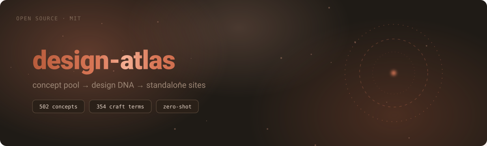
</p>

`banner` · theme `ember` · `dur` 12s · [spec](../../assets/specs/banner-readme.json)

A wide header strip, sized for a README hero.

<p align="center">
  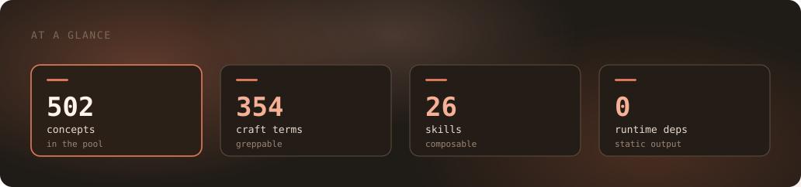
</p>

`cards` · theme `ember` · `dur` 6s · [spec](../../assets/specs/cards-stats.json)

Stat tiles that count up on one shared clock.

<p align="center">
  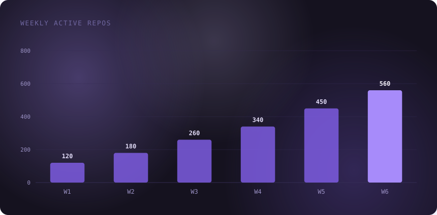
</p>

`chart` · theme `violet` · `dur` 8s · [spec](../../assets/specs/chart-bars.json)

The finished chart is the base state; the animation grows out of zero.

<p align="center">
  
</p>

`chart` · theme `forest` · `dur` 8s · [spec](../../assets/specs/chart-line.json)

The base attributes are the *finished* chart; the animation grows from zero. `highlight` picks the point that matters.

<p align="center">
  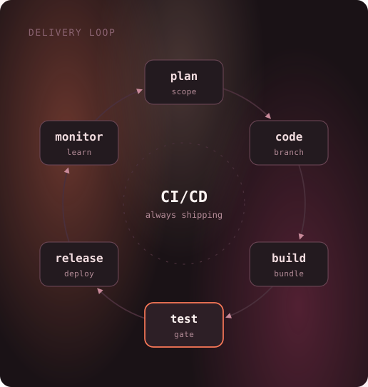
</p>

`cycle` · theme `sunset` · `dur` 9s · [spec](../../assets/specs/cycle-cicd.json)

A closed loop, so the end connects visibly to the start.

<p align="center">
  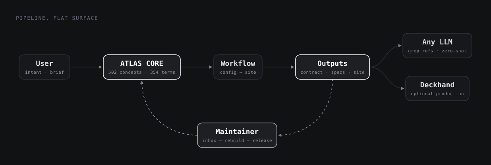
</p>

`flow` · theme `mono` · `dur` 10s · [spec](../../assets/specs/flow-flat.json)

Left-to-right stages on S-curve rails, with relay dots that dwell at each hop.

<p align="center">
  
</p>

`flow` · theme `ember` · `dur` 10s · [spec](../../assets/specs/flow-with-feedback.json)

Columns left to right, S-curve rails, relay dots with `keyPoints` so a dot *pauses* at a node instead of racing past it. The dashed return path is the `feedback` block, travelled only after the main hops.

<p align="center">
  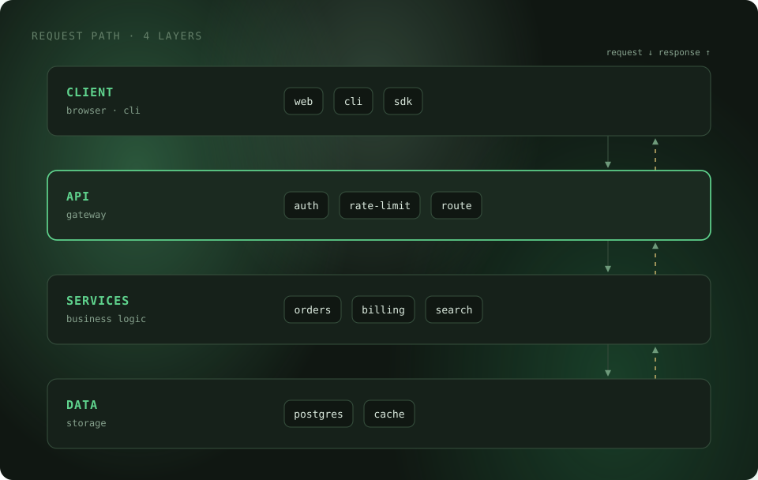
</p>

`layers` · theme `forest` · `dur` 10s · [spec](../../assets/specs/layers-stack.json)

A request travels down one lane and the response back up the other.

<p align="center">
  
</p>

`network` · theme `ocean` · `dur` 9s · [spec](../../assets/specs/network-services.json)

Pulses propagate by BFS depth from the `start` nodes, so the wave front visibly follows the dependency graph rather than a fixed stagger.

<p align="center">
  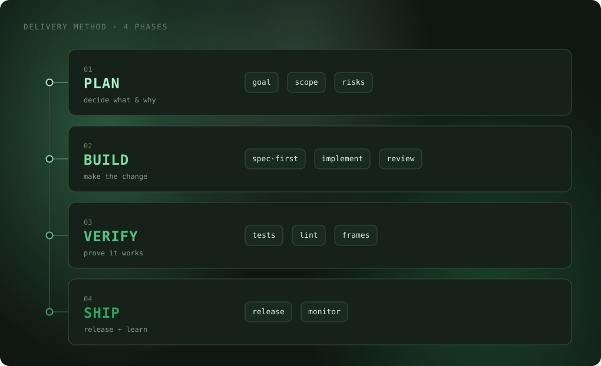
</p>

`phases` · theme `forest` · `dur` 8s · [spec](../../assets/specs/phases-method.json)

Ordered phases on one timeline, each lighting inside its own window.

<p align="center">
  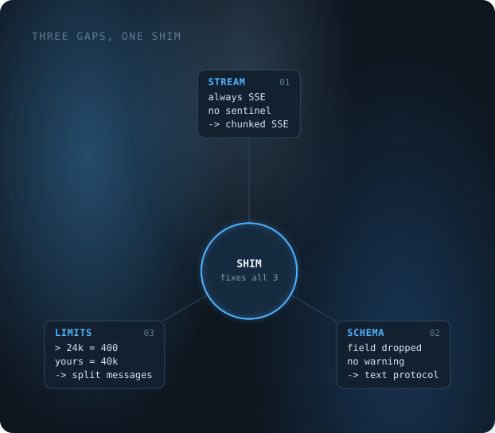
</p>

`radial` · theme `ocean` · `dur` 14s · [spec](../../assets/specs/radial-defects.json)

Cards around a hub, with signal radiating outward from the centre.

<p align="center">
  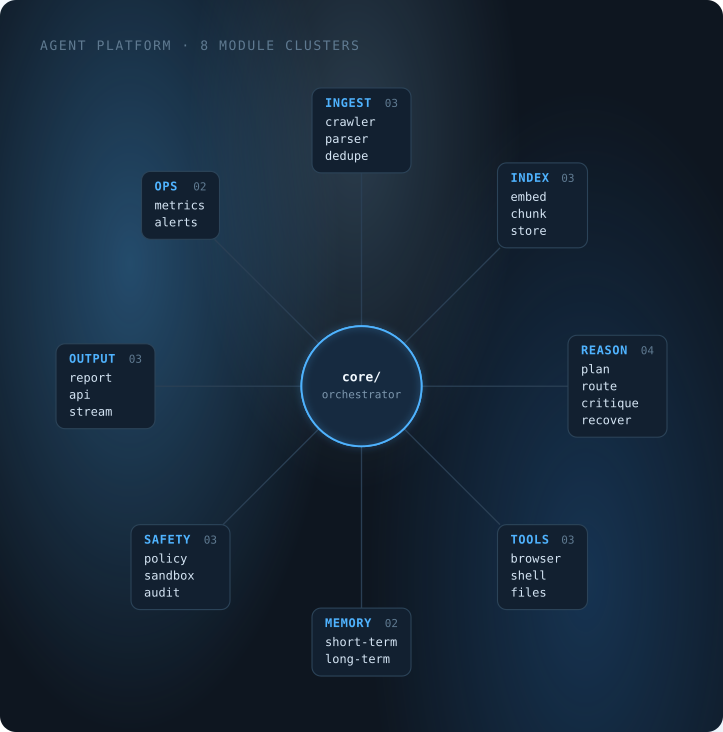
</p>

`radial` · theme `ocean` · `dur` 6s · [spec](../../assets/specs/radial-hub.json)

Cards around a hub, with signal radiating outward from the centre.

<p align="center">
  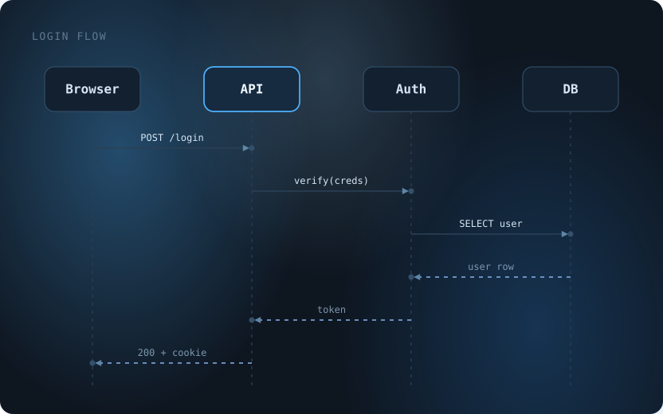
</p>

`sequence` · theme `ocean` · `dur` 10s · [spec](../../assets/specs/sequence-login.json)

Lifelines with dashed return messages, like a protocol trace.

<p align="center">
  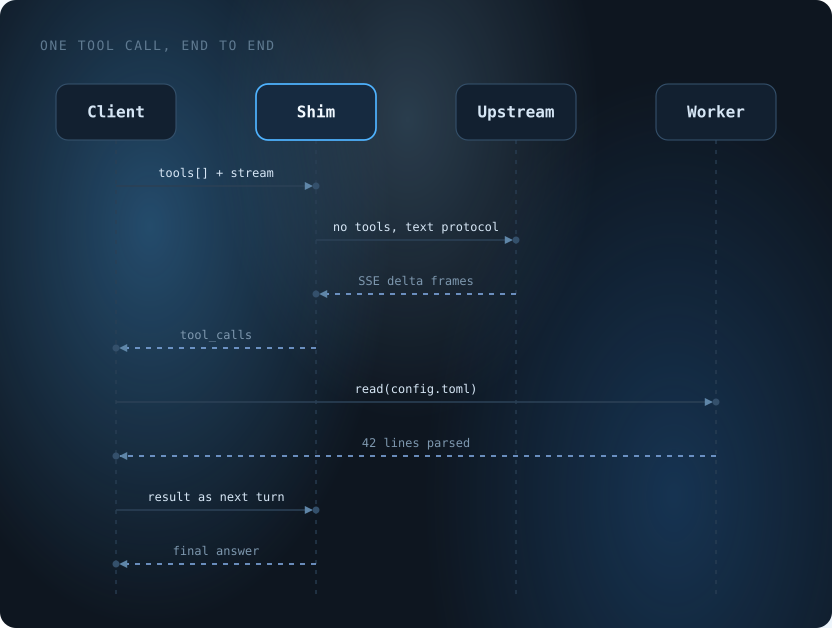
</p>

`sequence` · theme `ocean` · `dur` 16s · [spec](../../assets/specs/sequence-toolcall.json)

Lifelines with dashed return messages, like a protocol trace.

<p align="center">
  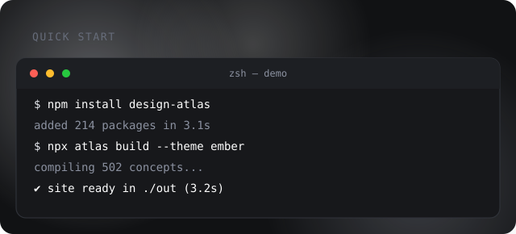
</p>

`terminal` · theme `mono` · `dur` 12s · [spec](../../assets/specs/terminal-demo.json)

All the text is in the base state; window-coloured cover rectangles slide away to reveal it. A viewer with SMIL disabled sees the finished session, not an empty prompt.

<p align="center">
  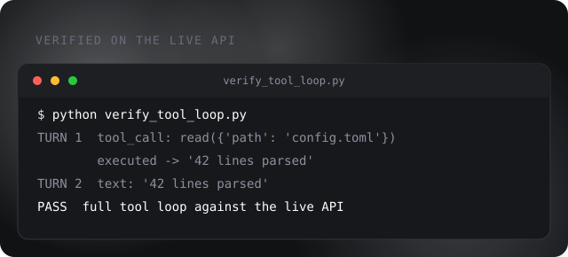
</p>

`terminal` · theme `mono` · `dur` 16s · [spec](../../assets/specs/terminal-verify.json)

Typed commands with cover rectangles sliding off to reveal real text.

<p align="center">
  
</p>

`timeline` · theme `violet` · `dur` 8s · [spec](../../assets/specs/timeline-roadmap.json)

The progress dot walks segment by segment and each milestone lights *on arrival*, which is what makes it read as progress rather than ambience.

## Things (30)

<p align="center">
  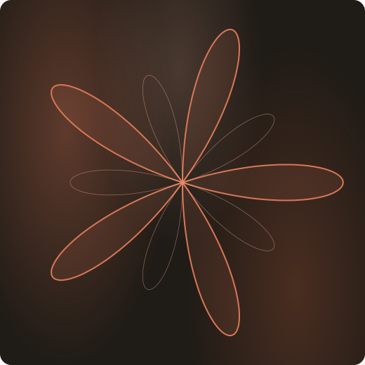
</p>

`art` · theme `ember` · `dur` 14s · [spec](../../assets/specs/art-flower.json)

Generative art, seeded so the spec reproduces byte-for-byte. (`variant: flower`).

<p align="center">
  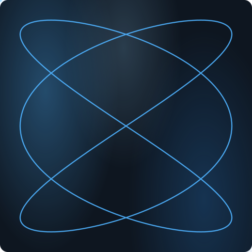
</p>

`art` · theme `ocean` · `dur` 14s · [spec](../../assets/specs/art-lissajous.json)

Generative art, seeded so the spec reproduces byte-for-byte. (`variant: lissajous`).

<p align="center">
  
</p>

`art` · theme `violet` · `dur` 14s · [spec](../../assets/specs/art-mandala.json)

Seeded, so the same spec always produces the same mandala. Generative art that is also reproducible, which is rarer than it sounds.

<p align="center">
  
</p>

`art` · theme `forest` · `dur` 14s · [spec](../../assets/specs/art-orbits.json)

Generative art, seeded so the spec reproduces byte-for-byte. (`variant: orbits`).

<p align="center">
  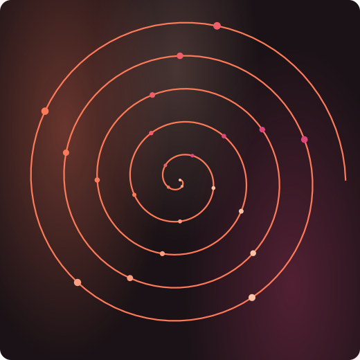
</p>

`art` · theme `sunset` · `dur` 14s · [spec](../../assets/specs/art-spiral.json)

Generative art, seeded so the spec reproduces byte-for-byte. (`variant: spiral`).

<p align="center">
  
</p>

`backdrop` · theme `ember` · `dur` 12s · [spec](../../assets/specs/backdrop-bubbles.json)

Ambient motion, slow and low contrast, meant to sit behind text. (`variant: bubbles`).

<p align="center">
  
</p>

`backdrop` · theme `forest` · `dur` 12s · [spec](../../assets/specs/backdrop-grid.json)

Ambient motion, slow and low contrast, meant to sit behind text. (`variant: grid`).

<p align="center">
  
</p>

`backdrop` · theme `sunset` · `dur` 12s · [spec](../../assets/specs/backdrop-mesh.json)

Slow, low-contrast ambient motion meant to sit behind text. The least interesting thing here on purpose.

<p align="center">
  
</p>

`backdrop` · theme `mono` · `dur` 12s · [spec](../../assets/specs/backdrop-rain.json)

Ambient motion, slow and low contrast, meant to sit behind text. (`variant: rain`).

<p align="center">
  
</p>

`backdrop` · theme `violet` · `dur` 12s · [spec](../../assets/specs/backdrop-stars.json)

Ambient motion, slow and low contrast, meant to sit behind text. (`variant: stars`).

<p align="center">
  
</p>

`backdrop` · theme `ocean` · `dur` 12s · [spec](../../assets/specs/backdrop-waves.json)

Ambient motion, slow and low contrast, meant to sit behind text. (`variant: waves`).

<p align="center">
  
</p>

`counter` · theme `forest` · `dur` 8s · [spec](../../assets/specs/counter-stats.json)

Odometer digit columns roll rather than jump, which is the whole trick: each digit translates inside a clipped window.

<p align="center">
  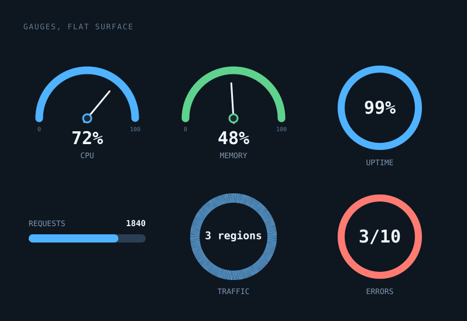
</p>

`gauge` · theme `ocean` · `dur` 8s · [spec](../../assets/specs/gauge-dashboard-flat.json)

Count up, hold, reset - the three phases of any gauge.

<p align="center">
  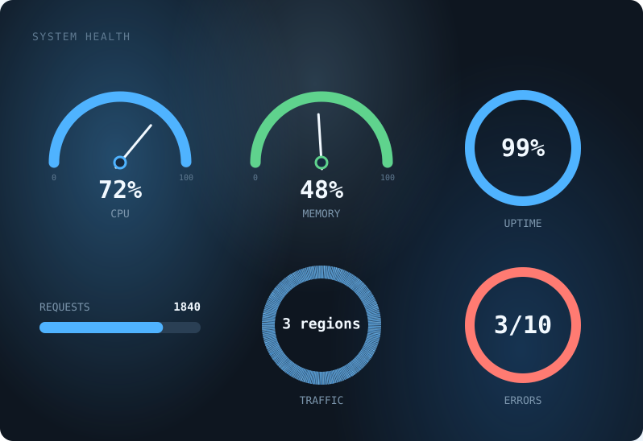
</p>

`gauge` · theme `ocean` · `dur` 8s · [spec](../../assets/specs/gauge-dashboard.json)

Count up, hold, reset - the three phases every dashboard gauge has, on one clock, with rings, bars and a donut.

<p align="center">
  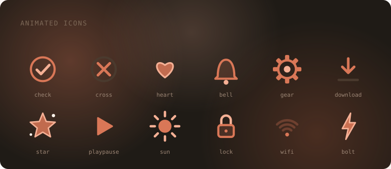
</p>

`icons` · theme `ember` · [spec](../../assets/specs/icons-set.json)

Twelve icons, twelve actions, each resting between its own beats.

<p align="center">
  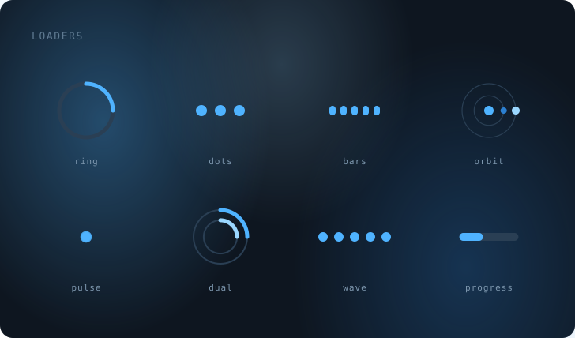
</p>

`loader` · theme `ocean` · [spec](../../assets/specs/loader-sheet.json)

Eight spinners, each on its own `period` and each resting between actions. Proof that variety does not need variety in code.

<p align="center">
  
</p>

`logo` · theme `violet` · `dur` 8s · [spec](../../assets/specs/logo-hexagon.json)

Draw, fill, shine - and frame 0 is already the finished mark.

<p align="center">
  
</p>

`logo` · theme `forest` · `dur` 8s · [spec](../../assets/specs/logo-shield.json)

The outline draws, then the fill arrives, then a shine sweeps across. Frame 0 is already the finished logo, so it reads with animation disabled.

<p align="center">
  
</p>

`morph` · theme `violet` · `dur` 13s · [spec](../../assets/specs/morph-shapes.json)

Star, circle, heart, bolt, drop and cross share **no path-command structure**, which is the one thing `<animate attributeName="d">` refuses to interpolate. `morph_path.py` resamples each pair into one uniform `M + n·C + Z` signature at build time, so this morphs with no library and no JavaScript. Full write-up in `references/morphing.md`.

<p align="center">
  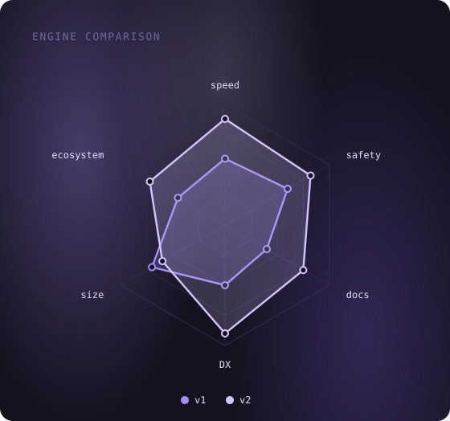
</p>

`radar` · theme `violet` · `dur` 8s · [spec](../../assets/specs/radar-skills.json)

Polygons grow from the centre outward, one ring at a time.

<p align="center">
  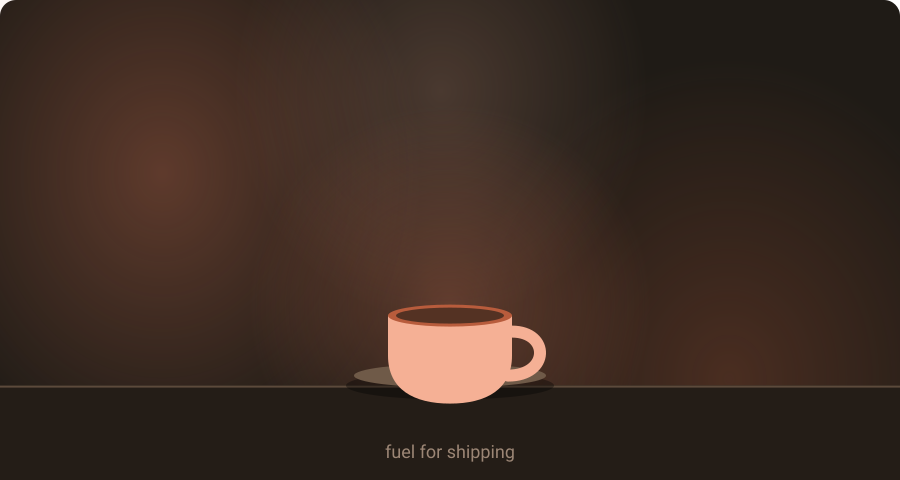
</p>

`scene` · theme `ember` · `dur` 8s · [spec](../../assets/specs/scene-coffee.json)

An illustrated scene with something moving in it.

<p align="center">
  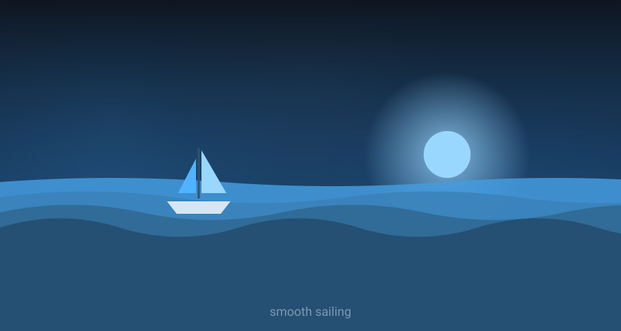
</p>

`scene` · theme `ocean` · `dur` 8s · [spec](../../assets/specs/scene-ocean.json)

An illustrated scene with something moving in it.

<p align="center">
  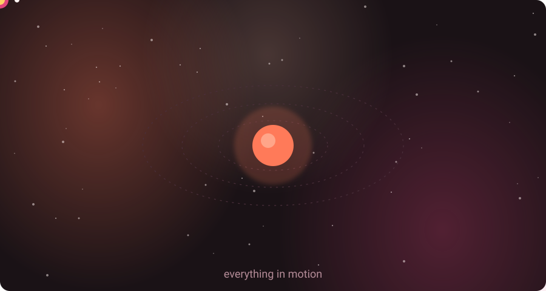
</p>

`scene` · theme `sunset` · `dur` 8s · [spec](../../assets/specs/scene-orbit.json)

An illustrated scene with something moving in it.

<p align="center">
  
</p>

`scene` · theme `violet` · `dur` 8s · [spec](../../assets/specs/scene-rocket.json)

An illustrated scene with something moving in it.

<p align="center">
  
</p>

`text` · theme `forest` · `dur` 6s · [spec](../../assets/specs/text-glitch.json)

Kinetic type: reveal, pop, per-letter type, shimmer, wave or glitch. (`variant: glitch`).

<p align="center">
  
</p>

`text` · theme `sunset` · `dur` 6s · [spec](../../assets/specs/text-pop.json)

Kinetic type: reveal, pop, per-letter type, shimmer, wave or glitch. (`variant: pop`).

<p align="center">
  
</p>

`text` · theme `ocean` · `dur` 6s · [spec](../../assets/specs/text-reveal.json)

Kinetic type: reveal, pop, per-letter type, shimmer, wave or glitch. (`variant: reveal`).

<p align="center">
  
</p>

`text` · theme `violet` · `dur` 6s · [spec](../../assets/specs/text-shimmer.json)

Kinetic type: reveal, pop, per-letter type, shimmer, wave or glitch. (`variant: shimmer`).

<p align="center">
  
</p>

`text` · theme `mono` · `dur` 6s · [spec](../../assets/specs/text-type.json)

Kinetic type: reveal, pop, per-letter type, shimmer, wave or glitch. (`variant: type`).

<p align="center">
  
</p>

`text` · theme `ember` · `dur` 6s · [spec](../../assets/specs/text-wave.json)

Kinetic type: reveal, pop, per-letter type, shimmer, wave or glitch. (`variant: wave`).

## Composed (8)

<p align="center">
  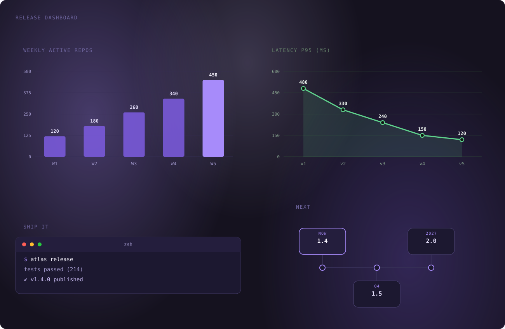
</p>

`compose` · theme `violet` · `dur` 10s · [spec](../../assets/specs/compose-dashboard.json)

Several types on one canvas and one master clock, each with its own window. (`grid` layout) (parts: chart, chart, terminal, timeline).

<p align="center">
  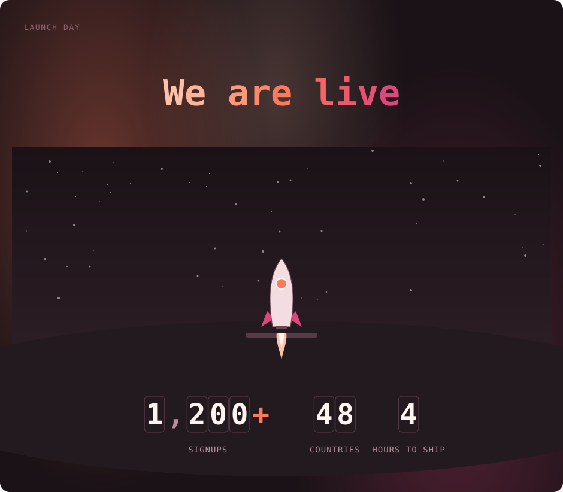
</p>

`compose` · theme `sunset` · `dur` 16s · [spec](../../assets/specs/compose-launch-story.json)

Several types on one canvas and one master clock, each with its own window. (`stack` layout) (parts: text, scene, counter).

<p align="center">
  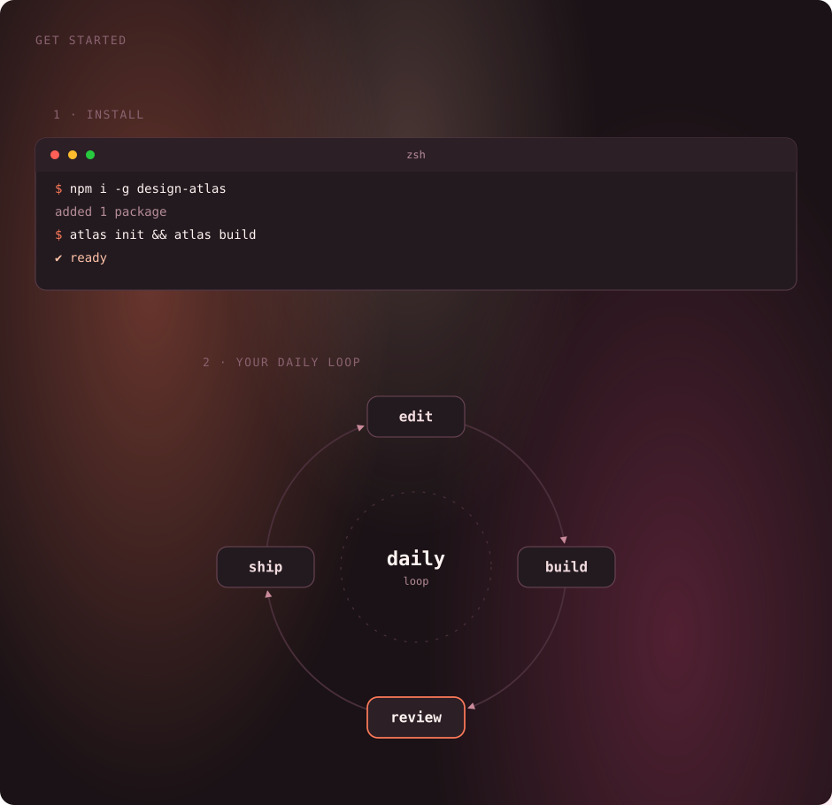
</p>

`compose` · theme `sunset` · `dur` 16s · [spec](../../assets/specs/compose-onboarding.json)

Several types on one canvas and one master clock, each with its own window. (`stack` layout) (parts: terminal, cycle).

<p align="center">
  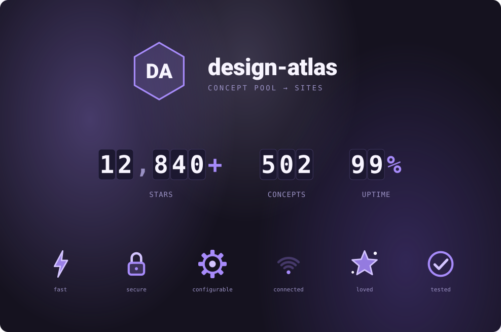
</p>

`compose` · theme `violet` · `dur` 14s · [spec](../../assets/specs/compose-product-hero.json)

Several types on one canvas and one master clock, each with its own window. (`stack` layout) (parts: logo, counter, icons).

<p align="center">
  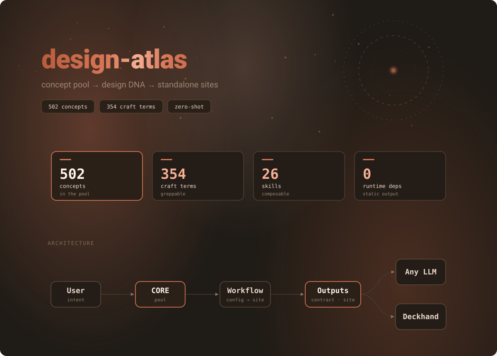
</p>

`compose` · theme `ember` · `dur` 12s · [spec](../../assets/specs/compose-readme-hero.json)

Several types on one canvas and one master clock, each with its own window. (`stack` layout) (parts: banner, cards, flow).

<p align="center">
  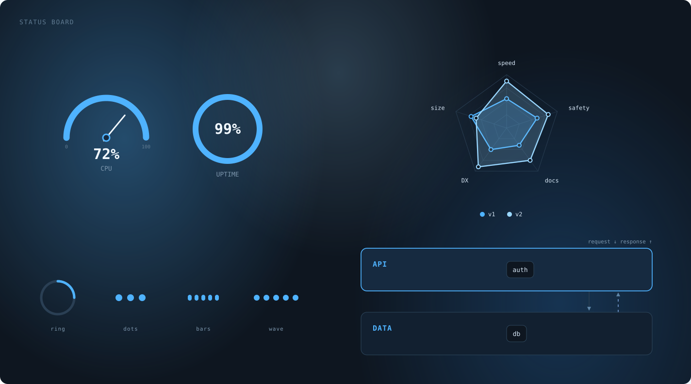
</p>

`compose` · theme `ocean` · `dur` 10s · [spec](../../assets/specs/compose-status-board.json)

Several types on one canvas and one master clock, each with its own window. (`grid` layout) (parts: gauge, radar, loader, layers).

<p align="center">
  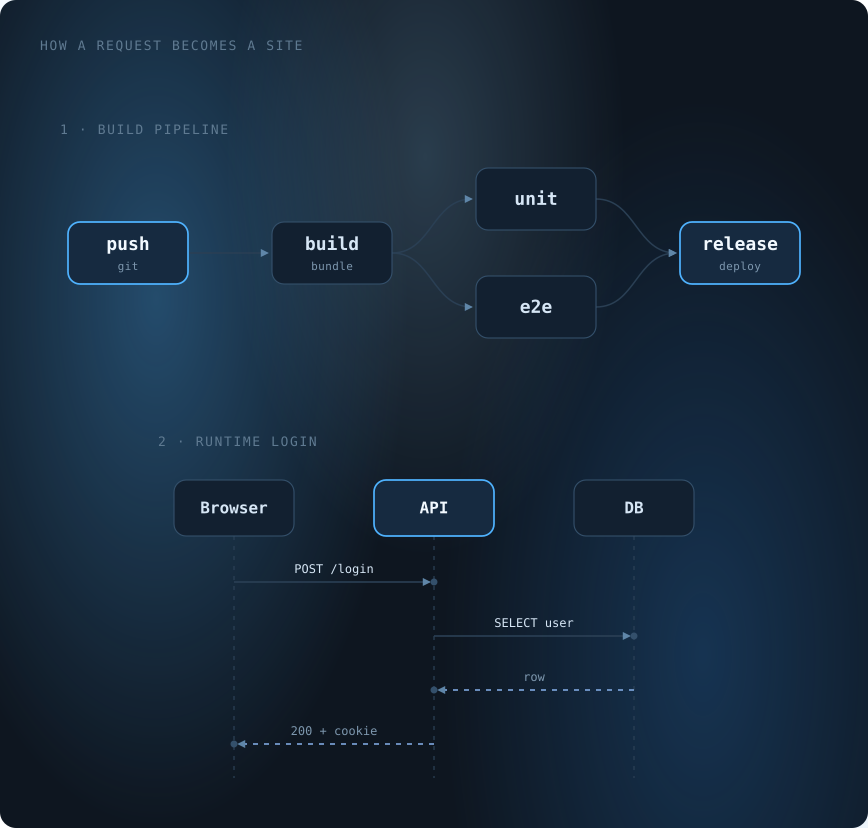
</p>

`compose` · theme `ocean` · `dur` 14s · [spec](../../assets/specs/compose-story.json)

Several types on one canvas and one master clock, each with its own window. (`stack` layout) (parts: flow, sequence).

<p align="center">
  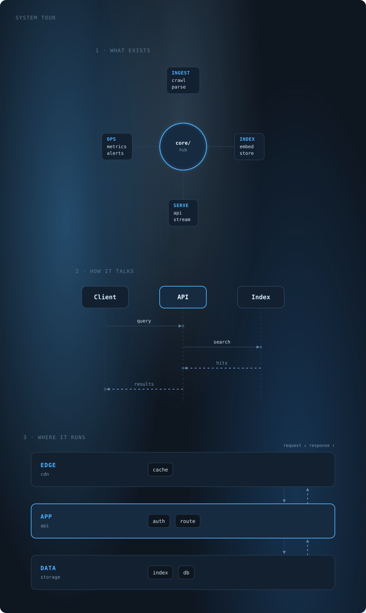
</p>

`compose` · theme `ocean` · `dur` 18s · [spec](../../assets/specs/compose-system-tour.json)

Several types on one canvas and one master clock, each with its own window. (`stack` layout) (parts: radial, sequence, layers).

---

## Themes (7)

Six palettes across all 55 examples. Pick one with `"theme"` in the spec;
`--theme` on the command line overrides it.

| theme | polarity | examples | representative |
|---|---|---|---|
| `ember` | dark | 9 | [](../../assets/examples/cards-stats.svg) |
| `ocean` | dark | 15 | [](../../assets/examples/network-services.svg) |
| `forest` | dark | 8 | [](../../assets/examples/counter-stats.svg) |
| `violet` | dark | 11 | [](../../assets/examples/radar-skills.svg) |
| `sunset` | dark | 7 | [](../../assets/examples/compose-launch-story.svg) |
| `mono` | dark | 5 | [](../../assets/examples/flow-flat.svg) |
| `paper` | light | 0 | _unused_ |

`paper` is defined and available but no spec uses it - it is the only light
palette, so light-theme output is untested by the examples. Build a pair with
`--pair paper <dark>` and it works; nothing here proves it.

**All 55 share one visual grammar** - a radial-gradient glow bed, a blur, and mono
type. That is deliberate consistency and it is also a limitation: six palettes is
not six looks. It is the open visual-range item in `HANDOVER.md`.

---

## All specs

| spec | type | theme | `dur` | blurb |
|---|---|---|---|---|
| [`art-flower`](../../assets/specs/art-flower.json) | `art` | `ember` | 14s | Generative art, seeded so the spec reproduces byte-for-byte |
| [`art-lissajous`](../../assets/specs/art-lissajous.json) | `art` | `ocean` | 14s | Generative art, seeded so the spec reproduces byte-for-byte |
| [`art-mandala`](../../assets/specs/art-mandala.json) | `art` | `violet` | 14s | Seeded, so the same spec always produces the same mandala |
| [`art-orbits`](../../assets/specs/art-orbits.json) | `art` | `forest` | 14s | Generative art, seeded so the spec reproduces byte-for-byte |
| [`art-spiral`](../../assets/specs/art-spiral.json) | `art` | `sunset` | 14s | Generative art, seeded so the spec reproduces byte-for-byte |
| [`backdrop-bubbles`](../../assets/specs/backdrop-bubbles.json) | `backdrop` | `ember` | 12s | Ambient motion, slow and low contrast, meant to sit behind text |
| [`backdrop-grid`](../../assets/specs/backdrop-grid.json) | `backdrop` | `forest` | 12s | Ambient motion, slow and low contrast, meant to sit behind text |
| [`backdrop-mesh`](../../assets/specs/backdrop-mesh.json) | `backdrop` | `sunset` | 12s | Slow, low-contrast ambient motion meant to sit behind text |
| [`backdrop-rain`](../../assets/specs/backdrop-rain.json) | `backdrop` | `mono` | 12s | Ambient motion, slow and low contrast, meant to sit behind text |
| [`backdrop-stars`](../../assets/specs/backdrop-stars.json) | `backdrop` | `violet` | 12s | Ambient motion, slow and low contrast, meant to sit behind text |
| [`backdrop-waves`](../../assets/specs/backdrop-waves.json) | `backdrop` | `ocean` | 12s | Ambient motion, slow and low contrast, meant to sit behind text |
| [`banner-readme`](../../assets/specs/banner-readme.json) | `banner` | `ember` | 12s | A wide header strip, sized for a README hero |
| [`cards-stats`](../../assets/specs/cards-stats.json) | `cards` | `ember` | 6s | Stat tiles that count up on one shared clock |
| [`chart-bars`](../../assets/specs/chart-bars.json) | `chart` | `violet` | 8s | The finished chart is the base state; the animation grows out of zero |
| [`chart-line`](../../assets/specs/chart-line.json) | `chart` | `forest` | 8s | The base attributes are the *finished* chart; the animation grows from zero |
| [`compose-dashboard`](../../assets/specs/compose-dashboard.json) | `compose` | `violet` | 10s | Several types on one canvas and one master clock, each with its own window |
| [`compose-launch-story`](../../assets/specs/compose-launch-story.json) | `compose` | `sunset` | 16s | Several types on one canvas and one master clock, each with its own window |
| [`compose-onboarding`](../../assets/specs/compose-onboarding.json) | `compose` | `sunset` | 16s | Several types on one canvas and one master clock, each with its own window |
| [`compose-product-hero`](../../assets/specs/compose-product-hero.json) | `compose` | `violet` | 14s | Several types on one canvas and one master clock, each with its own window |
| [`compose-readme-hero`](../../assets/specs/compose-readme-hero.json) | `compose` | `ember` | 12s | Several types on one canvas and one master clock, each with its own window |
| [`compose-status-board`](../../assets/specs/compose-status-board.json) | `compose` | `ocean` | 10s | Several types on one canvas and one master clock, each with its own window |
| [`compose-story`](../../assets/specs/compose-story.json) | `compose` | `ocean` | 14s | Several types on one canvas and one master clock, each with its own window |
| [`compose-system-tour`](../../assets/specs/compose-system-tour.json) | `compose` | `ocean` | 18s | Several types on one canvas and one master clock, each with its own window |
| [`counter-stats`](../../assets/specs/counter-stats.json) | `counter` | `forest` | 8s | Odometer digit columns roll rather than jump, which is the whole trick: each digit translates inside a clipped window |
| [`cycle-cicd`](../../assets/specs/cycle-cicd.json) | `cycle` | `sunset` | 9s | A closed loop, so the end connects visibly to the start |
| [`flow-flat`](../../assets/specs/flow-flat.json) | `flow` | `mono` | 10s | Left-to-right stages on S-curve rails, with relay dots that dwell at each hop |
| [`flow-with-feedback`](../../assets/specs/flow-with-feedback.json) | `flow` | `ember` | 10s | Columns left to right, S-curve rails, relay dots with `keyPoints` so a dot *pauses* at a node instead of racing past it |
| [`gauge-dashboard-flat`](../../assets/specs/gauge-dashboard-flat.json) | `gauge` | `ocean` | 8s | Count up, hold, reset - the three phases of any gauge |
| [`gauge-dashboard`](../../assets/specs/gauge-dashboard.json) | `gauge` | `ocean` | 8s | Count up, hold, reset - the three phases every dashboard gauge has, on one clock, with rings, bars and a donut |
| [`icons-set`](../../assets/specs/icons-set.json) | `icons` | `ember` | - | Twelve icons, twelve actions, each resting between its own beats |
| [`layers-stack`](../../assets/specs/layers-stack.json) | `layers` | `forest` | 10s | A request travels down one lane and the response back up the other |
| [`loader-sheet`](../../assets/specs/loader-sheet.json) | `loader` | `ocean` | - | Eight spinners, each on its own `period` and each resting between actions |
| [`logo-hexagon`](../../assets/specs/logo-hexagon.json) | `logo` | `violet` | 8s | Draw, fill, shine - and frame 0 is already the finished mark |
| [`logo-shield`](../../assets/specs/logo-shield.json) | `logo` | `forest` | 8s | The outline draws, then the fill arrives, then a shine sweeps across |
| [`morph-shapes`](../../assets/specs/morph-shapes.json) | `morph` | `violet` | 13s | Star, circle, heart, bolt, drop and cross share **no path-command structure**, which is the one thing `<animate attributeName="d">` refuses to interpolate |
| [`network-services`](../../assets/specs/network-services.json) | `network` | `ocean` | 9s | Pulses propagate by BFS depth from the `start` nodes, so the wave front visibly follows the dependency graph rather than a fixed stagger |
| [`phases-method`](../../assets/specs/phases-method.json) | `phases` | `forest` | 8s | Ordered phases on one timeline, each lighting inside its own window |
| [`radar-skills`](../../assets/specs/radar-skills.json) | `radar` | `violet` | 8s | Polygons grow from the centre outward, one ring at a time |
| [`radial-defects`](../../assets/specs/radial-defects.json) | `radial` | `ocean` | 14s | Cards around a hub, with signal radiating outward from the centre |
| [`radial-hub`](../../assets/specs/radial-hub.json) | `radial` | `ocean` | 6s | Cards around a hub, with signal radiating outward from the centre |
| [`scene-coffee`](../../assets/specs/scene-coffee.json) | `scene` | `ember` | 8s | An illustrated scene with something moving in it |
| [`scene-ocean`](../../assets/specs/scene-ocean.json) | `scene` | `ocean` | 8s | An illustrated scene with something moving in it |
| [`scene-orbit`](../../assets/specs/scene-orbit.json) | `scene` | `sunset` | 8s | An illustrated scene with something moving in it |
| [`scene-rocket`](../../assets/specs/scene-rocket.json) | `scene` | `violet` | 8s | An illustrated scene with something moving in it |
| [`sequence-login`](../../assets/specs/sequence-login.json) | `sequence` | `ocean` | 10s | Lifelines with dashed return messages, like a protocol trace |
| [`sequence-toolcall`](../../assets/specs/sequence-toolcall.json) | `sequence` | `ocean` | 16s | Lifelines with dashed return messages, like a protocol trace |
| [`terminal-demo`](../../assets/specs/terminal-demo.json) | `terminal` | `mono` | 12s | All the text is in the base state; window-coloured cover rectangles slide away to reveal it |
| [`terminal-verify`](../../assets/specs/terminal-verify.json) | `terminal` | `mono` | 16s | Typed commands with cover rectangles sliding off to reveal real text |
| [`text-glitch`](../../assets/specs/text-glitch.json) | `text` | `forest` | 6s | Kinetic type: reveal, pop, per-letter type, shimmer, wave or glitch |
| [`text-pop`](../../assets/specs/text-pop.json) | `text` | `sunset` | 6s | Kinetic type: reveal, pop, per-letter type, shimmer, wave or glitch |
| [`text-reveal`](../../assets/specs/text-reveal.json) | `text` | `ocean` | 6s | Kinetic type: reveal, pop, per-letter type, shimmer, wave or glitch |
| [`text-shimmer`](../../assets/specs/text-shimmer.json) | `text` | `violet` | 6s | Kinetic type: reveal, pop, per-letter type, shimmer, wave or glitch |
| [`text-type`](../../assets/specs/text-type.json) | `text` | `mono` | 6s | Kinetic type: reveal, pop, per-letter type, shimmer, wave or glitch |
| [`text-wave`](../../assets/specs/text-wave.json) | `text` | `ember` | 6s | Kinetic type: reveal, pop, per-letter type, shimmer, wave or glitch |
| [`timeline-roadmap`](../../assets/specs/timeline-roadmap.json) | `timeline` | `violet` | 8s | The progress dot walks segment by segment and each milestone lights *on arrival*, which is what makes it read as progress rather than ambience |

Browse them all in [`assets/examples/`](../../assets/examples) - they're plain SVG,
so any of them will animate in your browser too.
