# Gallery

Every animation on this page is a real generator output from `assets/examples/`,
and every one is **lint-clean**: `0 errors, 0 warnings`. They're not mockups — they're
the artifacts the skill ships, produced by `python scripts/run_pipeline.py <spec>`.

Regenerate any of them yourself:

```bash
python scripts/run_pipeline.py assets/specs/network-services.json --out-dir ./run
```

---

## Diagrams

<p align="center">
  
</p>

**`network`** — pulses propagate by BFS depth from the `start` nodes, so the wave
front visibly follows the dependency graph rather than a fixed stagger.

<p align="center">
  
</p>

**`flow`** — columns left to right, S-curve rails, relay dots with `keyPoints`
so a dot *pauses* at a node instead of racing past it. The dashed return path is
the `feedback` block, travelled only after the main hops.

<p align="center">
  
</p>

**`timeline`** — the progress dot walks segment by segment and each milestone
lights *on arrival*, which is what makes it read as progress rather than ambience.

<p align="center">
  
</p>

**`terminal`** — all the text is in the base state; window-coloured cover
rectangles slide away to reveal it. A viewer with SMIL disabled sees the finished
session, not an empty prompt.

<p align="center">
  
</p>

**`chart`** — the base attributes are the *finished* chart; the animation grows
from zero. `highlight:"max"` picks the bar or point that matters.

---

## Things

<p align="center">
  
</p>

**`loader`** — eight variants (`ring dots bars orbit pulse dual wave progress`)
on independent `period` clocks, because a spinner that syncs with everything else
stops reading as a spinner. Ask for one with `variant` + `cols: 1`.

<p align="center">
  
</p>

**`gauge`** — four kinds (`gauge ring bar donut`) that count up while the arc
sweeps, hold, then reset inside the loop. Base state is the finished value, so the
static frame is the KPI.

<p align="center">
  
</p>

**`radar`** — polygons grow from the centre by animating `points`, vertex dots pop
after the edge lands. Up to 4 series with a legend.

<p align="center">
  
</p>

**`logo`** — outline draws on → fill and initials → wordmark slides in → tagline →
one shine pass. Eight marks available (`hexagon diamond triangle pentagon circle
shield square`).

<p align="center">
  
</p>

**`counter`** — each digit column rolls `0-9,0-9` up to its target inside a clip,
staggered, with thousands separators added automatically.

<p align="center">
  
</p>

**`icons`** — twelve icons (`check cross heart bell gear download star playpause
sun lock wifi bolt`) drawn on a 24-unit grid, each resting between its action so
the set never feels like a disco.

<p align="center">
  
</p>

**`art`** — `mandala lissajous spiral orbits flower`, seeded so output is
reproducible. Decorative; pairs well with `text` or `logo` in a `compose` cover.

<p align="center">
  
</p>

**`backdrop`** — six ambient variants (`waves stars grid bubbles rain mesh`), all
slow and low-contrast on purpose. This is the bed a hero sits on, not the hero.

---

## Composed

The best results are usually several types sharing one canvas and one clock.

<p align="center">
  
</p>

<p align="center">
  
</p>

<p align="center">
  
</p>

<p align="center">
  
</p>

The mark is the exception — it was **hand-built** (Mode B), not generated, because
a logo has opinions a generator doesn't have.

---

## Not shown here

There are 52 examples in `assets/examples/`, one per spec. The ones worth opening
next:

| Spec | What it demonstrates |
|---|---|
| `compose-dashboard.json` | 2×2 grid, four different types, four different themes |
| `compose-system-tour.json` | three sequential thirds of the loop — one after another |
| `compose-launch-story.json` | text reveal → rocket scene → counters, disjoint windows |
| `sequence-login.json` | lifelines and dashed return messages |
| `layers-stack.json` | request down one lane, response up the other |
| `radial-hub.json` | sonar rings under the cards + a clockwise sweep |
| `text-type.json` | per-letter discrete reveal, works on any background |
| `backdrop-stars.json` | twinkle plus two shooting stars |
| `scene-orbit.json` | planets on ellipses around a sun |
| `chart-bars.json` | spring-like grow-in with the max bar highlighted |

Browse them all in [`assets/examples/`](../../assets/examples) — they're plain SVG,
so any of them will animate in your browser too.
